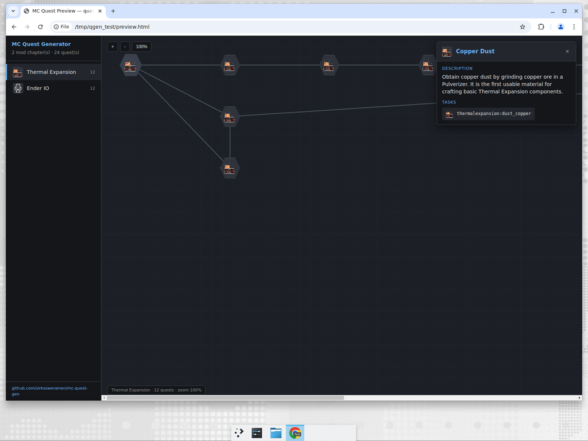

# MC Quest Generator

[English](#english) · [Русский](#русский)

---

## English

Automatically generates **FTB Quests (Minecraft 1.12.2)** quest chains for any list of mods, using an AI to figure out the per-mod tech-tree progression.

The AI receives mod metadata from Modrinth + a wiki excerpt + curated progression hints, and outputs a quest chain from "first basic material" up to "endgame item". The result is written as a ready-to-drop `config/ftbquests/quests.json`.

- One **chapter** per mod
- Quests linked in a dependency tree (left → right)
- **No rewards** — this is a progression cheat-sheet, not a hardcore questbook
- 9 pluggable AI providers with automatic fallback (Cloudflare is the *last* one, opt-in)
- **HTML preview** auto-generated next to the JSON — sidebar with mod chapters, clickable quest nodes with icons, dependency lines (no install required, just open in a browser)
- **Mod analyzer** with score-based recommendations (★★★ = perfect for quest generation)
- **Incremental updates** — `--append` adds new mods to an existing `quests.json` without regenerating old chapters; `--regenerate-mod` redoes a single chapter
- No 3rd-party Python deps — stdlib only



### Install

```bash
git clone https://github.com/sirksswenenen/mc-quest-gen
cd mc-quest-gen
# Python 3.10+ required, no pip install needed
python mc_quest_gen.py --setup
```

### Supported providers

| Provider | Key field(s) | Free? | Where to get a key |
|----------|--------------|-------|--------------------|
| **OpenRouter** | `openrouter.api_key` | yes, several `:free` models | https://openrouter.ai/keys |
| **Chutes** | `chutes.api_key` | trial credits | https://chutes.ai |
| **DeepSeek direct** | `deepseek.api_key` | paid (cheap) | https://platform.deepseek.com |
| **ElectronHub** | `electronhub.api_key` | varies | https://electronhub.ai |
| **Groq** | `groq.api_key` | free tier | https://console.groq.com |
| **HuggingFace router** | `huggingface.api_key` | monthly free credits | https://huggingface.co/settings/tokens |
| **Google Gemini** | `google_gemini.api_key` | free tier | https://aistudio.google.com/app/apikey |
| **g4f.space proxy** | `g4f_groq.api_key` | varies | https://g4f.space |
| **Cloudflare Workers AI** | `cloudflare.api_token` + `account_id` | free Workers tier | https://dash.cloudflare.com → AI → Workers AI |

> Cloudflare is intentionally placed at the **end** of the fallback chain. If you don't want your prompts going through CF, leave its fields empty and it will simply be skipped.

The fallback chain skips any provider with no key, any provider currently in a 429 cooldown, and any provider that returns an empty/error response — it tries the next one until one succeeds.

### Usage

```bash
# Diagnose providers (shows HTTP status of each)
python mc_quest_gen.py --test

# One mod
python mc_quest_gen.py -m "Thermal Expansion"

# Several mods
python mc_quest_gen.py -m "IC2" "Thermal Expansion" "Applied Energistics 2"

# From a file (one mod per line, # for comments)
python mc_quest_gen.py --mods-file mods.txt

# Russian quest text
python mc_quest_gen.py -m "Draconic Evolution" --lang ru

# Custom output folder
python mc_quest_gen.py -m "Mekanism" -o ./my_modpack

# See AI raw output + which provider was used
python mc_quest_gen.py -m "Botania" --verbose

# Analyze + interactively pick which mods to generate
python mc_quest_gen.py --analyze --mods-file mods.txt

# Analyze a folder of .jar files (auto-discovers mod names)
python mc_quest_gen.py --analyze --scan-dir /path/to/minecraft/mods

# Auto-pick top 10 best-scored mods, skip the prompt
python mc_quest_gen.py --analyze --top 10 --mods-file mods.txt

# List which mods are already present in an existing config
python mc_quest_gen.py --list-mods -o ./my_modpack

# Add new mods to an existing quests.json (skips mods already there)
python mc_quest_gen.py --append -m "Botania" "Thaumcraft" -o ./my_modpack

# Redo a single chapter (replaces the old one in place)
python mc_quest_gen.py --regenerate-mod "IC2" -o ./my_modpack

# Just rerender the HTML preview for an existing quests.json
python mc_quest_gen.py --html ./my_modpack/config/ftbquests/quests.json
```

### Example `mods.txt`

```
# Comments start with #
Thermal Expansion
IC2
Applied Energistics 2
Ender IO
Mekanism

Botania
Thaumcraft
Draconic Evolution
Tinkers Construct
```

### Output

```
mc_quests_output/
├── preview.html          ← standalone visual preview (open in any browser)
└── config/
    └── ftbquests/
        ├── quests.json   ← main file (drop into your instance)
        └── rewards/      ← empty by default
```

Copy `config/ftbquests/` into your Minecraft instance. In-game: `/ftbquests editing_mode`.

The `preview.html` is **self-contained** (no install, no server) — open it locally and you get a dark-themed FTB-Quests-style UI: left sidebar with mod chapters and icons, center canvas with hexagonal quest nodes connected by dependency lines, click any quest for full description + task items.

### Architecture

```
mc_quest_gen.py        ← CLI entry point, AI prompt builder
providers.py           ← 9 AI providers + fallback chain + diagnostics
scraper.py             ← Modrinth + FTB Wiki + Minecraft Wiki + curated stages
ftbquests.py           ← 1.12.2 JSON format generator + layout + parser
html_visualizer.py     ← preview.html renderer (sidebar + canvas + icons)
analyzer.py            ← mod scoring + interactive selection
providers_config.json  ← your API keys (created by --setup, gitignored)
```

### Diagnosing "All providers failed"

Run `python mc_quest_gen.py --test`. Each provider prints its actual HTTP status and the first part of the response body. Common causes:

- **OpenRouter `:free` 404** — model ID is outdated. The default fallback list ships with currently-existing free models (May 2026). If a model goes away, `--test` will surface it as `http_404` so you can swap it out.
- **OpenRouter 429** — your free-tier quota for that model is exhausted. The chain tries the next model and the next provider automatically.
- **Gemini 429 with `limit: 0`** — your Google API project doesn't have the Generative Language API enabled, or your free quota is fully consumed. Get a fresh key from https://aistudio.google.com/app/apikey.
- **g4f.space 403 `Just a moment…`** — g4f is behind Cloudflare bot challenge. Plain HTTP can't pass it. Skip this provider.
- **DeepSeek / Chutes 402** — your account balance is $0. Top up or use a different provider.
- **HuggingFace 402** — monthly Inference Providers credits depleted. Wait until reset or upgrade to PRO.

### License

MIT

---

## Русский

Автоматически генерирует цепочки квестов для **FTB Quests (Minecraft 1.12.2)** под любой список модов. ИИ получает метаданные мода (Modrinth + Wiki) и встроенные подсказки по тех-дереву, и выстраивает прогрессию от базовых материалов до эндгейма.

Результат — готовый `config/ftbquests/quests.json`, который сразу можно бросить в сборку.

- Одна **глава (chapter)** на мод
- Квесты связаны в дерево зависимостей (слева направо)
- **Без наград** — это шпаргалка по прогрессии, а не хардкорный гайдбук
- 9 ИИ-провайдеров с автофолбеком (Cloudflare — в конце цепочки, опционально)
- **HTML-превью** автоматически создаётся рядом с JSON — sidebar с модами, кликабельные шестигранники квестов с иконками, линии зависимостей (никаких установок, открой в браузере)
- **Анализатор модов** со score-рекомендациями (★★★ = идеально для квест-генерации)
- **Инкрементальные обновления** — `--append` дополняет существующий `quests.json` новыми модами без перегенерации старых; `--regenerate-mod` пересобирает одну главу
- Никаких внешних Python-зависимостей — только stdlib


### Установка

```bash
git clone https://github.com/sirksswenenen/mc-quest-gen
cd mc-quest-gen
# Нужен Python 3.10+, ничего ставить через pip не нужно
python mc_quest_gen.py --setup
```

### Провайдеры

| Провайдер | Поле(я) ключа | Бесплатно? | Где взять ключ |
|-----------|---------------|------------|----------------|
| **OpenRouter** | `openrouter.api_key` | да, несколько `:free` моделей | https://openrouter.ai/keys |
| **Chutes** | `chutes.api_key` | trial-кредиты | https://chutes.ai |
| **DeepSeek прямой** | `deepseek.api_key` | платный (дешёво) | https://platform.deepseek.com |
| **ElectronHub** | `electronhub.api_key` | по тарифу | https://electronhub.ai |
| **Groq** | `groq.api_key` | бесплатный тариф | https://console.groq.com |
| **HuggingFace router** | `huggingface.api_key` | ежемесячные free кредиты | https://huggingface.co/settings/tokens |
| **Google Gemini** | `google_gemini.api_key` | бесплатный тариф | https://aistudio.google.com/app/apikey |
| **g4f.space прокси** | `g4f_groq.api_key` | по тарифу | https://g4f.space |
| **Cloudflare Workers AI** | `cloudflare.api_token` + `account_id` | бесплатный план Workers | https://dash.cloudflare.com → AI → Workers AI |

> Cloudflare намеренно в самом конце цепочки. Если не хочешь, чтобы твои промпты шли через CF — оставь поля пустыми, провайдер пропустится автоматически.

Цепочка фолбека пропускает провайдеры без ключа, провайдеры в активном 429-cooldown'е, и провайдеры, вернувшие пустой/ошибочный ответ — пробует следующий, пока один не сработает.

### Использование

```bash
# Диагностика провайдеров (видны HTTP-коды и тексты ошибок)
python mc_quest_gen.py --test

# Один мод
python mc_quest_gen.py -m "Thermal Expansion"

# Несколько модов
python mc_quest_gen.py -m "IC2" "Thermal Expansion" "Applied Energistics 2"

# Из файла (один мод на строку, # — комментарий)
python mc_quest_gen.py --mods-file mods.txt

# На русском
python mc_quest_gen.py -m "Draconic Evolution" --lang ru

# Своя папка вывода
python mc_quest_gen.py -m "Mekanism" -o ./my_modpack

# Подробный режим — видно сырой ответ ИИ и какой провайдер сработал
python mc_quest_gen.py -m "Botania" --verbose

# Проанализировать список модов и интерактивно выбрать
python mc_quest_gen.py --analyze --mods-file mods.txt

# Просканировать папку с .jar-файлами (имена модов угадываются автоматически)
python mc_quest_gen.py --analyze --scan-dir /path/to/minecraft/mods

# Авто-выбрать топ-10 лучших по скору, без интерактива
python mc_quest_gen.py --analyze --top 10 --mods-file mods.txt

# Посмотреть, какие моды уже есть в существующем конфиге
python mc_quest_gen.py --list-mods -o ./my_modpack

# Добавить новые моды в существующий quests.json (старые не трогаются)
python mc_quest_gen.py --append -m "Botania" "Thaumcraft" -o ./my_modpack

# Переделать одну конкретную главу (старая удаляется, новая встаёт на её место)
python mc_quest_gen.py --regenerate-mod "IC2" -o ./my_modpack

# Просто перерисовать preview.html для существующего quests.json
python mc_quest_gen.py --html ./my_modpack/config/ftbquests/quests.json
```

### Пример `mods.txt`

```
# Комментарии — со знака #
Thermal Expansion
IC2
Applied Energistics 2
Ender IO
Mekanism

Botania
Thaumcraft
Draconic Evolution
Tinkers Construct
```

### Вывод

```
mc_quests_output/
├── preview.html          ← автономное визуальное превью (открой в любом браузере)
└── config/
    └── ftbquests/
        ├── quests.json   ← главный файл (брось в сборку)
        └── rewards/      ← пусто по умолчанию
```

Скопируй `config/ftbquests/` в папку Minecraft-инстанса. В игре: `/ftbquests editing_mode`.

`preview.html` — **самодостаточный** (никаких установок, никаких серверов): открываешь локально и получаешь тёмный UI в стиле FTB Quests — слева sidebar с модами и иконками, в центре канвас с шестигранными квест-нодами, соединёнными линиями зависимостей; клик по квесту → полное описание + предметы-таски.

### Архитектура

```
mc_quest_gen.py        ← CLI, сборщик промптов для ИИ
providers.py           ← 9 ИИ-провайдеров + цепочка фолбека + диагностика
scraper.py             ← Modrinth + FTB Wiki + Minecraft Wiki + встроенные стадии
ftbquests.py           ← Генератор JSON под 1.12.2 + раскладка + парсер
html_visualizer.py     ← Рендер preview.html (sidebar + канвас + иконки)
analyzer.py            ← Скоринг модов + интерактивный выбор
providers_config.json  ← Твои ключи (создаётся через --setup, в .gitignore)
```

### Если всё валится с "All providers failed"

Запусти `python mc_quest_gen.py --test`. Для каждого провайдера будет показан реальный HTTP-код и начало тела ответа. Типичные причины:

- **OpenRouter `:free` 404** — ID модели устарел. По умолчанию в коде уже свежий список free-моделей (на май 2026). Если какая-то модель пропала, `--test` покажет это как `http_404` — поправь в `providers_config.json`.
- **OpenRouter 429** — твой free-тариф на эту модель выжран. Цепочка автоматически перейдёт к следующей модели и следующему провайдеру.
- **Gemini 429 с `limit: 0`** — в твоём Google-проекте не включён Generative Language API, или дневная квота на нуле. Возьми свежий ключ на https://aistudio.google.com/app/apikey.
- **g4f.space 403 `Just a moment…`** — g4f закрыт Cloudflare bot challenge. Простым HTTP не пробивается. Пропусти этого провайдера.
- **DeepSeek / Chutes 402** — баланс аккаунта $0. Пополни или используй другой провайдер.
- **HuggingFace 402** — месячные кредиты Inference Providers закончились. Жди ресета или подписывайся на PRO.

### Лицензия

MIT
